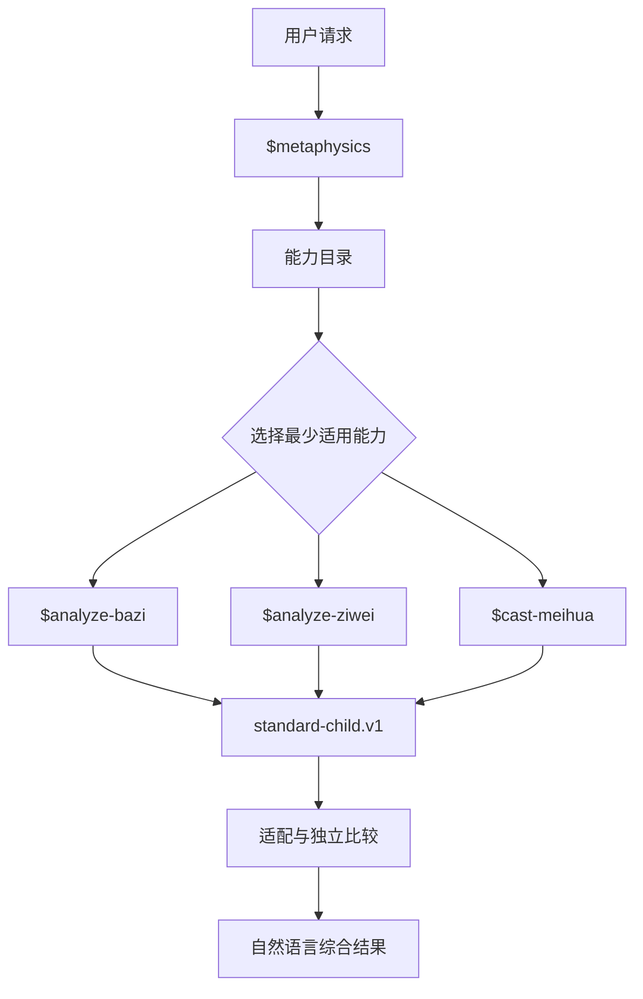

# 玄学 Skill


[](LICENSE)


**Route traditional Chinese metaphysics methods with explicit time provenance and clear boundaries.**

一个面向 ChatGPT、Codex 与兼容 Skills 环境的模块化传统术数项目。

它用一个统一入口理解问题、推荐方法、拆分任务和综合结果，同时把八字、紫微斗数与梅花易数保留为可独立调用、可独立维护的子 Skill。

> 当前状态：**稳定维护**。现有能力已经完成阶段性收口；新方法、知识库、历法工具和专题工作流保留扩展位置，但目前不作为承诺中的开发路线。



## 当前能力

| Skill | 调用名 | 适用范围 | 当前状态 |
|---|---|---|---|
| 玄学 Skill | `$metaphysics` | 方法建议、最小能力选择、多问题拆分、组合编排与标准化综合 | 已启用 |
| 八字分析 | `$analyze-bazi` | 以真太阳时为计算口径的四柱结构、十神、旺衰、调候、格局、用神、大运流年与合盘 | 已启用 |
| 紫微斗数分析 | `$analyze-ziwei` | 以真太阳时为排盘口径的本命、十二宫领域、大限、流年与候选盘敏感性 | 已启用 |
| 梅花易数 | `$cast-meihua` | 可冻结民用时或真太阳时的农历时起卦、两数／三数起卦及有界事件解读 | 已启用 |

当前没有接入六爻，也没有把知识查询、通用历法、命理起名或择日伪装成现有方法。遇到未接入能力时，主 Skill 会明确说明能力缺口。

## 设计目标

- 统一入口，但不建立包办所有算法的“超级 Skill”。
- 每种方法均可直接调用，也可由主 Skill 按问题需要分派。
- 默认选择一个最合适的方法；组合必须有明确、互补的职责。
- 不以方法数量或多方法结论一致制造更高可信度。
- 计算事实、传统解释、现实资料与行动建议分层表达。
- 每个子 Skill 自包含，可单独安装、运行与版本管理。
- 正式 Skill 包不保存用户资料、真实案例、运行结果或开发验证材料。

## 时间口径

项目先接受并原样保留用户给出的民用日期时间与 IANA 时区，再按方法 profile 决定实际计算口径：

- 八字与紫微斗数在使用出生时辰时采用真太阳时。用户只有民用时间时，系统先引导补充地区／经度以便换算，或请用户直接提供已经换算的真太阳日期时间／时辰；不会把民用时静默冒充真太阳时。未来接入六爻时也沿用这一输入流程，但当前不会为尚不存在的六爻 provider 建占位实现。
- 梅花易数允许 `civil` 与 `true_solar` 两种正式口径。起卦前必须冻结一种，结果中明确披露；民用时不是失败后的降级方案。
- 真太阳时可记录为用户声明或工具核验。两者都可保留，但证据等级不同；只有工具核验才可声明工具版本、访问日期与参数。
- 缺少真太阳时并不视为执行错误。资料可补时返回最少补充项；地点已齐但当前没有可靠换算能力时，明确请用户提供外部换算结果。
- 靠近时辰、换日或节气边界时保留候选，不依据经历或期待反选命盘。

当前项目不内置一个未经独立验证的近似太阳时公式。未来若接入历法 utility，仍须保持来源、算法版本与边界候选可追溯。

## 架构

主 Skill 只负责能力选择、输入采集、分派、结果适配与综合，不在自身内部排八字、排紫微或起梅花卦。组合调用时，各子 Skill 独立执行，彼此不可读取对方结果。

能力目录预留四类 provider：

- `method`：执行传统术数方法。当前唯一启用的类型。
- `knowledge`：未来可用于有来源的术数知识与典籍查询。
- `utility`：未来可用于历法、时间规范化或排盘校验等确定性工具。
- `workflow`：未来可用于命理起名、择日等明确交付目标的专题流程。

预留类型不是已经实现的功能。没有真实调用目标、输入输出契约和运行依赖时，不会被激活或模拟。

## 路由规则

### 明确指定一个方法

直接使用对应子 Skill：

- 明确要求八字、四柱或子平分析：`$analyze-bazi`
- 明确要求紫微斗数、十二宫、大限或紫微流年：`$analyze-ziwei`
- 明确要求梅花易数或梅花起卦：`$cast-meihua`

### 未指定方法或要求综合

使用 `$metaphysics`。主 Skill 会先判断问题形态和时间尺度，再选择最少的适用方法；真正会改变选择时，才补问一个关键问题。

### 普通现实问题

普通职业、关系、写作、事实查询，以及产品、品牌或变量命名，不会仅因可以类比到“运势”而自动触发玄学 Skill。

### 未接入的方法或能力

主 Skill 不会猜测、模拟或静默换成相近方法。用户明确要求六爻、奇门、知识库查询、命理起名、择日等尚未接入的能力时，会如实返回当前状态。

## 组合分析

默认使用一个方法，通常最多使用两个。三个方法只适用于用户明确需要且确实存在三个独立、互不重叠的问题单元。

| 问题层级 | 更适合的当前方法 |
|---|---|
| 整体结构、长期背景、双人互动结构 | 八字 |
| 明确人生领域、本命与十年／年度阶段 | 紫微斗数 |
| 单一、具体且有观察期限的当前问题 | 梅花易数 |

组合不是投票。只有对象、命题、条件和时间范围兼容的主张才会比较；其余结果会标记为互补或不可比较。任一分支失败时，仍可单独成立的其他结果可以继续交付，但不会补造缺失结论。

## 项目结构

```text
metaphysics-skill-true-solar/
├── README.md
├── LICENSE
├── GITHUB_UPLOAD_GUIDE.md
├── .gitignore
├── .gitattributes
└── skills/
    ├── metaphysics/
    ├── analyze-bazi/
    ├── analyze-ziwei/
    └── cast-meihua/
```

每个 `skills/*` 目录都是一个完整、独立的 Skill 包，包含自己的 `SKILL.md`、必要引用、脚本和资源。仓库级文档只位于项目根目录，不进入可安装 Skill 包。

## 安装与使用

建议同时安装四个 Skill 目录，以获得完整的路由和组合能力。若只需要一种明确方法，也可以仅安装对应子 Skill。

安装方式取决于当前 ChatGPT 或 Codex 环境。让 Codex 从本仓库安装时，应指向具体的 `skills/<skill-name>/` 目录，并使用 Skill 创建／安装流程完成校验，不要把整个仓库根目录当作单个 Skill。

### 调用示例

方法建议：

```text
$metaphysics 我不知道八字还是紫微更适合看未来几年的事业阶段，请先帮我选择方法。
```

组合分析：

```text
$metaphysics 请把长期结构与当前这个有明确期限的问题拆开，选择适合的方法分别分析后再综合。
```

单独使用八字：

```text
$analyze-bazi 请核验这份四柱的结构，再区分原局、旺衰、调候和大运流年进行分析。
```

单独使用紫微斗数：

```text
$analyze-ziwei 请围绕一个明确领域，分析本命结构及目标大限或流年的阶段重点。
```

单独使用梅花易数：

```text
$cast-meihua 请针对一个已经冻结问题和观察期限的事项，按指定方法起卦并解释。
```

涉及出生时间时，请同时准备民用日期时间、IANA 时区和出生地区；若已有真太阳时结果，也可直接提供并注明是用户声明还是工具换算。梅花起卦则可直接说明本次采用民用时或真太阳时。

以上只是抽象调用方式，不包含真实出生资料、命盘或问事个案。

## 结果协议

三个子 Skill 均使用 `metaphysics.standard-child.v1` 返回结构化结果，主要包括：

- 实际回答的问题与适用时间尺度；
- 主要发现与可比较的 `claims[]`；
- 依据、假设、不确定性和能力限制；
- 完整且只出现一次的原生 `method_payload`。

主 Skill 使用当前 `method-v4` execution profile，将子结果经 `orchestration.v4`、adapter 与 route-output 协议适配、比较并渲染为自然语言。协议对象默认是内部结构，不要求在普通用户答复中展示。

## 数据与发布原则

- 不在 Skill 包中保存姓名、出生资料、命盘、问事内容、聊天记录或其他用户信息。
- 不在 Skill 包中保存真实案例、运行日志、调试输出或开发验证材料。
- 子 Skill 不依赖兄弟目录的运行时文件；复制或单独安装后仍应自包含。
- 主 Skill 不复制子方法算法或知识表。
- 紫微斗数包内置的第三方引擎及其许可文件必须原样保留。
- 项目根目录可以包含不涉及个人信息的使用说明，但这些文档不属于 Skill 运行内容。

## 当前不做的内容

- 六爻、奇门遁甲等新增术数方法；
- 独立的周易或术数知识库 provider；
- 通用历法 utility；
- 命理起名、择日等专题 workflow；
- 为尚不存在的能力建立占位调用；
- 用多方法一致性换算概率、准确率或置信度；
- 为扩展而提前升级现有稳定协议。

这些方向保留在能力模型中，但只有出现明确需求、真实实现和可版本化契约时才考虑接入。

## 扩展要求

新增能力至少应满足：

1. 存在真实、可调用且自包含的 provider；
2. 触发范围、输入要求、运行依赖和输出契约明确；
3. 方法算法、知识资料和第三方依赖有清楚的版本与来源；
4. 能在项目外完成验证，且不把验证材料或用户资料装进 Skill；
5. 先完成子 Skill，再登记到能力目录并设为启用；
6. 若新能力不是 `method`，先建立匹配其语义的编排协议，不冒充现有方法结果。

## 维护策略

项目当前采用稳定维护模式：

- 修复已确认的算法、契约或兼容问题；
- 处理依赖完整性、引用断链和触发边界漂移；
- 只有出现具体使用需求时才评估新增能力；
- 不以预留架构为理由持续扩大项目规模。

## 认识边界

本项目把八字、紫微斗数和梅花易数作为传统文化解释与反思框架，不宣称其具有科学预测效力。传统方法输出不能替代现实证据，也不应被包装成客观概率或确定事实。

## 许可证

除 `analyze-ziwei` 中另有标注的第三方组件外，本项目采用 [GNU Affero General Public License v3.0](LICENSE)（AGPL-3.0）发布。

`analyze-ziwei` 所含第三方组件的许可证与声明位于其自身 `scripts/vendor/licenses/` 目录；相关文件须原样保留，第三方组件继续适用其各自许可证。
